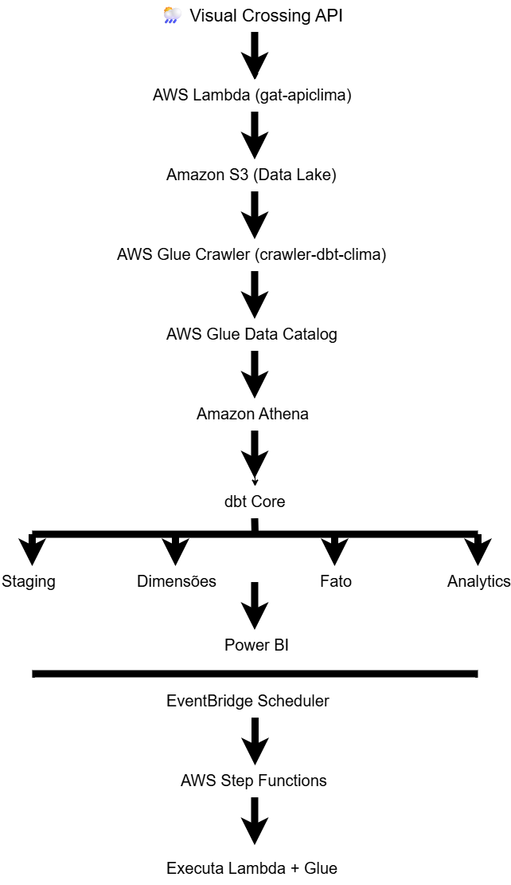
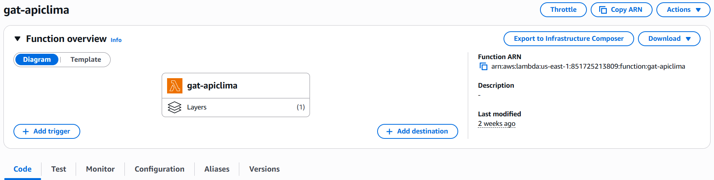
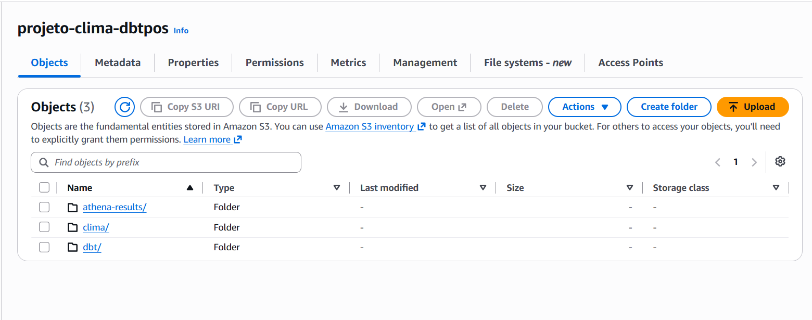
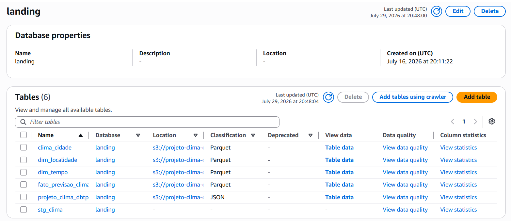

<div align="center">

# 🌦️ ClimaBR Data Pipeline

### Pipeline de Engenharia de Dados utilizando AWS, dbt Core, Amazon Athena e Power BI


</div>

---

# 📌 Sobre o Projeto

O **ClimaBR Data Pipeline** é um projeto de Engenharia de Dados desenvolvido como parte da Pós-Graduação em Engenharia de Dados e Inteligência Artificial.

O objetivo do projeto é construir um pipeline completo para coleta, armazenamento, transformação e disponibilização de dados meteorológicos utilizando uma arquitetura moderna baseada em serviços da AWS.

Os dados são obtidos através da API **Visual Crossing Weather**, armazenados em um **Data Lake no Amazon S3**, catalogados pelo **AWS Glue**, transformados utilizando **dbt Core** e disponibilizados para consultas através do **Amazon Athena**, permitindo posteriormente sua utilização em ferramentas de Business Intelligence como o **Power BI**.

---

# 🏗️ Arquitetura da Solução

<p align="center">
  
</p>

---

# ☁️ AWS Lambda

<p align="center">
  
</p>

A função **gat-apiclima** é responsável por consumir diariamente a API Visual Crossing Weather, realizar o tratamento inicial dos dados meteorológicos e armazenar os arquivos JSON no bucket Amazon S3 que compõe o Data Lake do projeto.

---

# 🪣 Amazon S3

<p align="center">
  
</p>

O Amazon S3 é utilizado como Data Lake do projeto, armazenando os arquivos brutos provenientes da API. Esses arquivos servem como origem para o AWS Glue Catalog e para as consultas realizadas pelo Amazon Athena.

---

# 📚 AWS Glue

<p align="center">
  
</p>

O AWS Glue Crawler identifica automaticamente os arquivos armazenados no S3 e atualiza o Data Catalog, permitindo que os dados sejam consultados pelo Amazon Athena sem necessidade de criação manual das tabelas.

---

# 🎯 Objetivos

- Automatizar a ingestão diária de dados meteorológicos.
- Construir um Data Lake na AWS.
- Aplicar boas práticas de Engenharia de Dados utilizando dbt Core.
- Implementar modelagem dimensional.
- Disponibilizar dados prontos para análises.
- Automatizar todo o pipeline utilizando serviços serverless da AWS.

---

# 🚀 Tecnologias Utilizadas

| Categoria | Tecnologia |
|------------|------------|
| Linguagem | Python 3.12 |
| Cloud | Amazon Web Services (AWS) |
| Armazenamento | Amazon S3 |
| Catálogo de Dados | AWS Glue |
| Consulta SQL | Amazon Athena |
| Transformação | dbt Core |
| Orquestração | AWS Step Functions |
| Agendamento | Amazon EventBridge Scheduler |
| BI | Power BI |
| Versionamento | Git + GitHub |

---

# ✅ Status do Projeto

| Etapa | Status |
|---------|:------:|
| Coleta de Dados (API) | ✅ |
| AWS Lambda | ✅ |
| Amazon S3 | ✅ |
| Glue Crawler | ✅ |
| Glue Data Catalog | ✅ |
| Amazon Athena | ✅ |
| dbt Core | ✅ |
| Modelagem Dimensional | ✅ |
| Testes dbt | ✅ |
| Step Functions | ✅ |
| EventBridge Scheduler | ✅ |
| GitHub | ✅ |
| Power BI | 🚧 Em evolução |
| AWS CodeBuild | ⏳ Próxima etapa |

---

# 📈 Fluxo do Pipeline

```text
Visual Crossing API
        │
        ▼
AWS Lambda
        │
        ▼
Amazon S3 (Data Lake)
        │
        ▼
Glue Crawler
        │
        ▼
Glue Data Catalog
        │
        ▼
Amazon Athena
        │
        ▼
dbt Core
        │
        ▼
Camada Analytics
        │
        ▼
Power BI
```

---

# 📊 Modelagem de Dados

O projeto foi estruturado utilizando a arquitetura recomendada pelo dbt:

```
Staging
     │
     ▼
Dimensões
     │
     ▼
Tabela Fato
     │
     ▼
Analytics
```

As principais camadas são:

### 🔹 Staging

Responsável pela limpeza, padronização e tratamento inicial dos dados provenientes da API.

Modelo:

- stg_clima

---

### 🔹 Dimensões

Contêm os dados descritivos utilizados nas análises.

Modelos:

- dim_localidade
- dim_tempo

---

### 🔹 Fato

Armazena as métricas meteorológicas.

Modelo:

- fato_previsao_clima

---

### 🔹 Analytics

Camada preparada para consumo por ferramentas de BI.

Modelo:

- clima_cidade

---

# 🧪 Qualidade dos Dados

O projeto utiliza testes automatizados do dbt para garantir a qualidade dos dados.

Testes implementados:

- ✅ not_null
- ✅ unique
- ✅ relationships

Resultado atual:

**18 testes executados com sucesso.**

---

# 📊 Dashboard

O projeto disponibiliza os dados para consumo através do Power BI.

> **Observação:** O dashboard será aprimorado futuramente durante a disciplina de Business Intelligence da pós-graduação, incorporando boas práticas de modelagem, DAX, UX e visualizações analíticas.

---

# 🔄 Automação

Toda a execução do pipeline é automatizada utilizando serviços serverless da AWS.

Fluxo:

EventBridge Scheduler

↓

AWS Step Functions

↓

AWS Lambda

↓

Amazon S3

↓

Glue Crawler

↓

dbt (próxima etapa: AWS CodeBuild)

---

# 📁 Estrutura do Projeto

```text
climabr-data-pipeline/

├── analyses/
├── macros/
├── models/
│   └── staging/
├── seeds/
├── snapshots/
├── tests/
├── dbt_project.yml
├── README.md
└── .gitignore
```

---

# 🚀 Próximas Melhorias

- Implementar AWS CodeBuild para execução automática do dbt.
- Adicionar documentação da arquitetura.
- Publicar diagramas da solução.
- Melhorar o dashboard no Power BI.
- Criar documentação técnica do pipeline.
- Adicionar monitoramento e observabilidade.

---

# 👨‍💻 Autor

**Forlan Paiva Miranda**

Projeto desenvolvido durante a Pós-Graduação em Engenharia de Dados e Inteligência Artificial.

GitHub:

https://github.com/paivaforlan

---

# ⭐ Se este projeto foi útil

Considere deixar uma ⭐ no repositório.